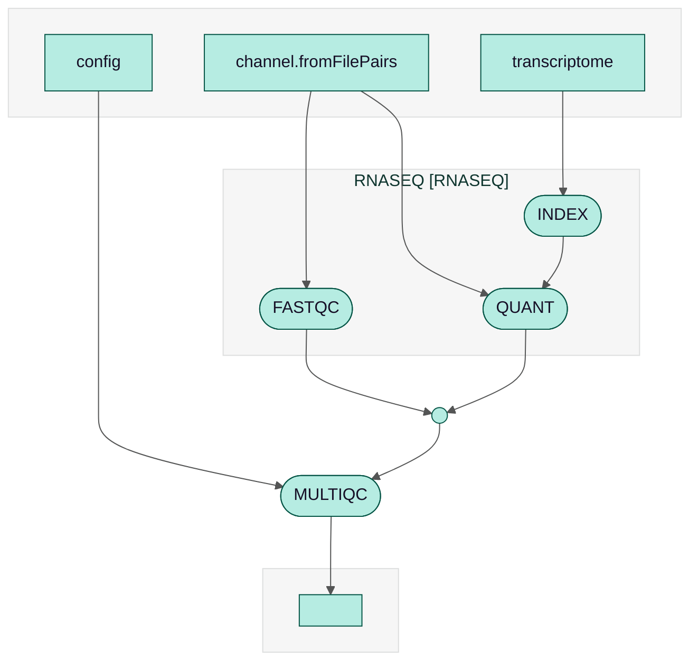

# rnaseq-nf pipeline

A basic pipeline for quantification of genomic features from short-read data, implemented with [Nextflow](http://www.nextflow.io).

[](http://nextflow.io)

## Requirements

* Unix-like operating system (Linux, macOS, etc)
* Java 17

## Quickstart

1. Install [Docker](https://docs.docker.com/) if you don't have it already.

2. Install Nextflow (version 25.10 or later):

   ```bash
   curl -s https://get.nextflow.io | bash
   ```

3. Launch the pipeline:

   ```bash
   ./nextflow run nextflow-io/rnaseq-nf -profile docker
   ```

4. When the run completes, open the following report in your browser:

   ```bash
   results/multiqc_report.html
   ```

You can view an [example report](https://seqera.io/examples/rna-seq/multiqc_report) in the MultiQC documentation.

> [!NOTE]
>
> When you run the pipeline for the first time, it will take a moment to download the pipeline from this GitHub repository and the associated Docker image(s).

## Workflow diagram

Here is the [workflow diagram](https://docs.seqera.io/nextflow/reports#workflow-diagram) of rnaseq-nf, generated by Nextflow using `-with-dag`:



## Executors

The rnaseq-nf pipeline uses [Nextflow](http://www.nextflow.io) to define the workflow logic separately from the underlying execution environment. This allows the pipeline to be executed seamlessly on a local machine, an HPC cluster, or a cloud provider, by simply applying a specific *configuration profile*.

Config profiles are provided for the following executors:

- AWS Batch (`batch`)
- Azure Batch (`azure-batch`)
- Google Batch (`google-batch`)
- SLURM (`slurm`)

By default, the pipeline executes tasks locally. Use the `-profile` option to run with a different executor:

```bash
nextflow run rnaseq-nf -profile slurm
```

You can also provide custom configuration for your environment, if none of the built-in profiles meet your needs. Create a `nextflow.config` file in the launch directory:

```groovy
process {
    executor = 'uge'
    queue = 'my-queue'
}
```

The above example will make Nextflow submit jobs to a UGE cluster using the `my-queue` queue.

See the Nextflow documentation to learn more about [Executors](https://docs.seqera.io/nextflow/executor) and [Configuration](https://docs.seqera.io/nextflow/config).

## Software dependencies

The rnaseq-nf pipeline uses the following software tools:

* [Salmon](https://combine-lab.github.io/salmon/)
* [FastQC](https://www.bioinformatics.babraham.ac.uk/projects/fastqc/)
* [MultiQC](https://multiqc.info)
