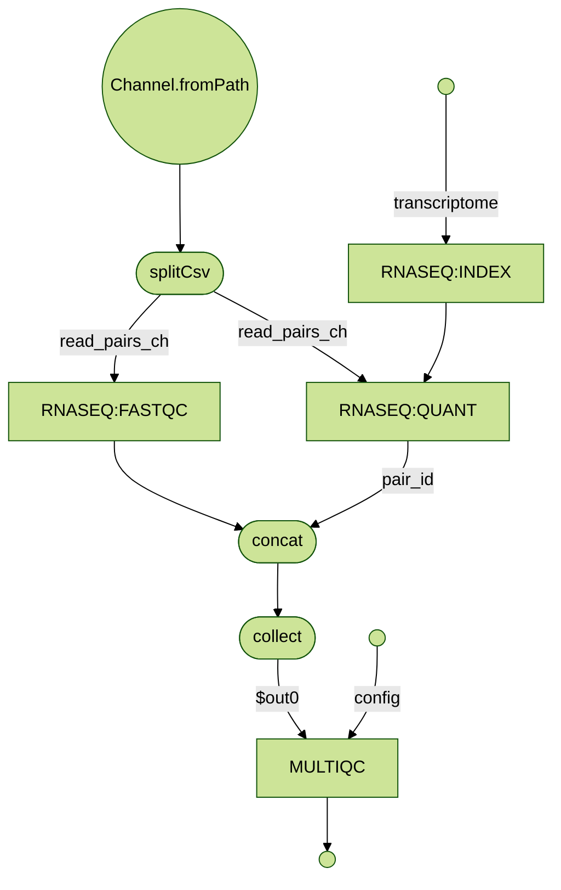

# RNAseq-NF pipeline 

A basic pipeline for quantification of genomic features from short read data
implemented with Nextflow.

[](http://nextflow.io)


## Requirements 

* Unix-like operating system (Linux, macOS, etc)
* Java 11 

## Quickstart 

1. If you don't have it already install Docker in your computer. This example uses Docker as the local container runtime for Wave. Read more [here](https://docs.docker.com/).

2. Install Nextflow (version 23.10.0 or later):
      
        curl -s https://get.nextflow.io | bash

3. Launch the pipeline execution with the bundled example samplesheet:

        ./nextflow run nextflow-io/rnaseq-nf

4. When the execution completes open in your browser the report generated at the following path:

        results/multiqc_report.html 
	
You can see an example report at the following [link](http://multiqc.info/examples/rna-seq/multiqc_report.html).	
	
Note: the very first time you execute it, it will take a few minutes to download the pipeline 
from this GitHub repository and let Wave provision the containers needed to execute the workflow.  

## Samplesheet input

The pipeline now accepts an input CSV via `--input`, with the repository default pointing to `data/samplesheet.csv`.
The samplesheet uses the following header row:

```csv
sample,fastq_1,fastq_2
```

Paired-end example:

```csv
sample,fastq_1,fastq_2
ggal_gut,ggal/ggal_gut_1.fq,ggal/ggal_gut_2.fq
```

Single-end example (`fastq_2` left blank):

```csv
sample,fastq_1,fastq_2
ggal_gut,ggal/ggal_gut_1.fq,
```

Relative FASTQ paths are resolved from the directory containing the samplesheet, which makes it easy to keep a portable `samplesheet.csv` alongside your data. The pipeline accepts both paired-end and single-end rows.

## Profiles

This example intentionally keeps only a small set of profiles:

- `all-reads` — convenience profile that runs the full bundled example dataset via `data/samplesheet_all.csv`

Examples:

```bash
./nextflow run .
./nextflow run . --input /path/to/samplesheet.csv
./nextflow run . -profile all-reads
```

## Pipeline flowchart

Here is a visual representation of the design of RNASeq-NF pipeline, generated using the [visualization functionality](https://www.nextflow.io/docs/latest/tracing.html#dag-visualisation) of Nextflow.



## Execution notes

This repository is now tuned as a small local-first example for agentic development work.
If you want to run it on HPC or cloud executors, add a separate config overlay rather than
re-expanding the built-in profile list.

## Data lineage

Data lineage is enabled in `nextflow.config` via `lineage.enabled = true`, so recent Nextflow
versions will record workflow runs, task executions, and published outputs in a local `.lineage/`
store by default.

Useful commands after a run:

```bash
nextflow lineage list
nextflow lineage render <LID>
```

This feature is experimental in Nextflow and was introduced in Nextflow 25.04, so use a compatible recent release when exploring lineage metadata.

## nf-schema integration

This example keeps nf-schema usage intentionally minimal:

- parameter validation via `validateParameters()`
- parameter summary logging via `paramsSummaryLog(workflow)`
- CSV input validation for `--input` via `assets/schema_input.json`

Schema files in this repository:

- `nextflow_schema.json` — full schema containing all pipeline parameters currently defined in `main.nf`
- `nextflow_schema.minimal.json` — reduced schema exposing only `input` and `outdir` for simplified launch forms in Seqera Platform

The pipeline schema advertises the samplesheet as `text/csv`, which lets Seqera Platform show compatible CSV datasets in the Launchpad input selector. In Seqera Platform you can use the repository default schema for the full form, or choose **Repository path** and point to `nextflow_schema.minimal.json` for the minimal form.

## Components 

RNASeq-NF uses the following software components and tools: 

* [Salmon](https://combine-lab.github.io/salmon/)
* [FastQC](https://www.bioinformatics.babraham.ac.uk/projects/fastqc/)
* [MultiQC](https://multiqc.info)
